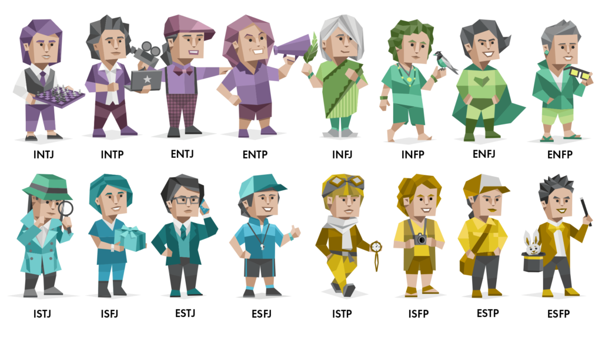

```{r setup, include=FALSE}
knitr::opts_chunk$set(echo = TRUE)
```

```{r, include=FALSE}
library(knitr)
library(corrplot)
library(dplyr)
library(caret) #suggested by skelethon
library(ggplot2)
library(tidyverse)
library(DALEX)
library(fastshap)
library(iml)
library(Rtsne)
```

<center>
  
</center>

This project was developed by Amanda Tartarotti Cardozo da Silva for the Advanced Machine Learning course in the 2025/2026 academic year of the Master in Computacional Engineering and Intelligent Systems at University of Basque Country (EHU/UPV).

This project is structured into 5 key topics:

1. Data Loading and Analysis
  * 1.1 Data Visualization
  * 1.2 Correlations between genders
  * 1.3 Correlations between predictors
2. Data Cleaning and PreProcessing
  * 2.1 Variable Encoding
  * 2.2 Handling Missing Values
  * 2.3 Outliers Detection
  * 2.4 Data Splitting
  * 2.5 Feature Extraction (PCA)
  * 2.6 Data Preprocessing
3. Models Implementation
  * 3.1 Model 1: LDA model
  * 3.2 Model 2: k-Nearest Neighbors
  * 3.3 Model 3: Random Forest Classifier 
4. Results Analysis
  * 4.1 Model Comparison
5. Interpretable Machine Learning
  * 5.1 Feature Importance & Effects
  * 5.2 Feature Effects
  * 5.3 Local Explanations (SHAP values)
  * 5.4 Counterfactual Explanations
  * 5.5 T-SNE Visualization
6. Experimental Extension: Semi-Supervised Learning
  * 6.1 Scenario Simulation
  * 6.2 Self-Training Implementation
  * 6.3 Comparative Performance Analysis
7. Final Conclusions

## 1. Data Loading and Analysis

This dataset is designed to explore and predict Myers-Briggs Type Indicator (MBTI) personality types based on a combination of demographic factors, interest areas, and personality scores. It includes 100K+ samples, each representing an individual with various features that contribute to determining their MBTI type. The dataset uses pre-processed numerical scores, making it a tabular supervised classification problem.

📌 Want to take this personality test yourself before diving in? https://www.16personalities.com/free-personality-test

Let's go back to the dataset description:

**Age:** A continuous variable representing the age of the individual.

**Gender:** A categorical variable indicating the gender of the individual. Possible values are 'Male' and 'Female'.

**Education:** A binary variable. A value of 1 indicates the individual has at least a graduate-level education (or higher), and 0 indicates an undergraduate, high school level or Uneducated.

**Interest:** A categorical variable representing the individual's primary area of interest.

**Introversion Score:** A continuous variable ranging from 0 to 10, representing the individual's tendency toward introversion versus extraversion. Higher scores indicate a greater tendency toward extraversion.

**Sensing Score:** A continuous variable ranging from 0 to 10, representing the individual's preference for sensing versus intuition. Higher scores indicate a preference for sensing.

**Thinking Score:** A continuous variable ranging from 0 to 10, indicating the individual's preference for thinking versus feeling. Higher scores indicate a preference for thinking.

**Judging Score:** A continuous variable ranging from 0 to 10, representing the individual's preference for judging versus perceiving. Higher scores indicate a preference for judging.

**Personality:** Target variable that contains the People Personality Type.


```{r}
df <- read.csv("data.csv", stringsAsFactors = TRUE)

val_personality <- unique(df$Personality)
total_personality <- length(val_personality)

cat("There are:", total_personality, " possible personalities:\n")
print(val_personality)
```

**Evaluation metrics that will used for this project**:

* **Accuracy**: to measure the overall percentage of correct predictions.
* **Kappa**: to measures the agreement between the predicted and observed classifications, accounting for the possibility of agreement occurring by chance.
* **Confusion Matrix**: to observe which specific profiles the model is confusing.

**Nature of the Problem**: this is a Multiclass Supervised Classification scenario, since there are more than two possible categories and there is no intrinsic order among them, and the main challenge of this analysis lies in the potential overlap of traits between similar personalities.

### 1.1 Data Visualization

```{r}
# Gender Data
gender_data <- df %>%
  count(Gender) %>%
  mutate(perc = n / sum(n) * 100)

ggplot(gender_data, aes(x = Gender, y = n, fill = Gender)) +
  geom_bar(stat = "identity") +
  geom_text(aes(label = paste0(round(perc, 1), "%")), vjust = -0.5) +
  theme_minimal() +
  labs(title = "Distribution of Gender",
       y = "Count", x = "Gender") +
  scale_fill_brewer(palette = "Set2") +
  theme(legend.position = "none")
```
```{r}
# Education Distribution
edu_data <- df %>% count(Education) %>% mutate(perc = n / sum(n) * 100, Education = as.factor(Education))

ggplot(edu_data, aes(x = Education, y = n, fill = Education)) +
  geom_bar(stat = "identity") +
  geom_text(aes(label = paste0(round(perc, 1), "%")), vjust = -0.5) +
  theme_minimal() +
  labs(title = "Distribution of Education Level",
       subtitle = "0: Undergraduate/HS | 1: Graduate+",
       y = "Count", x = "Education Category") +
  scale_fill_manual(values = c("0" = "#999999", "1" = "#E69F00")) + 
  theme(legend.position = "none")
```
```{r}
# Distribution of Interests
interest_data <- df %>%
  count(Interest) %>%
  mutate(perc = n / sum(n) * 100)

ggplot(interest_data, aes(x = reorder(Interest, -n), y = n, fill = Interest)) +
  geom_bar(stat = "identity") +
  geom_text(aes(label = paste0(round(perc, 1), "%")), vjust = -0.5) +
  theme_minimal() +
  labs(title = "Primary Areas of Interest",
       y = "Count", x = "Interest Category") +
  theme(legend.position = "none")
```

Some highlights we can get from this visualization:

1. Gender and Education are balanced
2. Around 38% of the people in this dataset either do not know their interests or are not ready to share

### 1.2 Correlations between genders

```{r}
edu_gender_data <- df %>%
  mutate(Education_Label = ifelse(Education == "1", "Graduate+", "Undergrad/HS")) %>%
  group_by(Gender, Education_Label) %>%
  summarise(count = n(), .groups = 'drop') %>%
  group_by(Gender) %>%
  mutate(percentage = count / sum(count) * 100)

ggplot(edu_gender_data, aes(x = Gender, y = percentage, fill = Education_Label)) +
  geom_bar(stat = "identity", position = "stack") +
  geom_text(aes(label = paste0(round(percentage, 1), "%")), 
            position = position_stack(vjust = 0.5), color = "white", fontface = "bold") +
  theme_minimal() +
  labs(title = "Proportion of Education Level per Gender",
       subtitle = "Comparing educational background across gender groups",
       x = "Gender", 
       y = "Percentage (%)",
       fill = "Education Level") +
  scale_fill_manual(values = c("Graduate+" = "#2C3E50", "Undergrad/HS" = "#2980B9")) +
  theme(legend.position = "bottom")
```
**Key Findings**:

* Males and females with less than graduate-level education make up the largest proportions.

* There is a slightly higher proportion of males with a graduate-level education compared to females, but the difference is not drastic.

* The proportions of individuals with at least a graduate-level education (both males and females) are lower compared to those with less than graduate-level education.

```{r}
interest_gender_data <- df %>%
  group_by(Gender, Interest) %>%
  summarise(count = n(), .groups = 'drop') %>%
  group_by(Gender) %>%
  mutate(percentage = count / sum(count) * 100)

ggplot(interest_gender_data, aes(x = reorder(Interest, -percentage), y = percentage, fill = Gender)) +
  geom_bar(stat = "identity", position = "dodge", color = "white") +
  # Add percentage labels on top of each bar
  geom_text(aes(label = paste0(round(percentage, 1), "%")), 
            position = position_dodge(width = 0.9), vjust = -0.5, size = 3) +
  theme_minimal() +
  labs(title = "Primary Interests by Gender",
       subtitle = "Side-by-side comparison of interest profiles",
       x = "Interest Category", 
       y = "Percentage within Gender (%)",
       fill = "Gender") +
  scale_fill_manual(values = c("Female" = "#D35400", "Male" = "#2980B9")) +
  theme(legend.position = "top")
```
**Key Findings**:

* Both Males and Females show the same pattern in interests with varying numbers (Understandable as Males are more in this dataset)
* Both have them do not really like to share their interests which can be visualized in the above graph
* Males and Females show inclination towards Arts, which is the leading Interest
* Both the genders are more inclined towards sports than technology

```{r}

p_density <- ggplot(df, aes(x = Introversion.Score, fill = Gender)) +
  geom_density(alpha = 0.5) +
  theme_minimal() +
  labs(title = "Introversion Score Distribution by Gender",
       subtitle = "Comparing the 'Introversion vs Extraversion' axis",
       x = "Introversion Score (Higher = More Extraverted)", 
       y = "Density") +
  scale_fill_manual(values = c("Female" = "#8E44AD", "Male" = "#2ECC71")) +
  theme(legend.position = "top")

p_boxplot <- ggplot(df, aes(x = Gender, y = Introversion.Score, fill = Gender)) +
  geom_boxplot(alpha = 0.7) +
  theme_minimal() +
  labs(title = "Introversion Score Summary by Gender",
       x = "Gender", 
       y = "Introversion Score") +
  scale_fill_manual(values = c("Female" = "#8E44AD", "Male" = "#2ECC71")) +
  theme(legend.position = "none")

# Display the density plot
print(p_density)
```
**Key Findings**:

* Male and Female seems to have similar proportions of Introversion Score in this dataset

### 1.3 Correlations between predictors

```{r}
df_scores_long <- df %>%
  select(Personality, Introversion.Score, Sensing.Score, Thinking.Score, Judging.Score) %>%
  pivot_longer(cols = -Personality, 
               names_to = "Trait", 
               values_to = "Score")

ggplot(df_scores_long, aes(x = Personality, y = Score, fill = Trait)) +
  geom_boxplot(outlier.size = 0.5, alpha = 0.8) +
  facet_wrap(~Trait, scales = "free_x", ncol = 2) + 
  coord_flip() + 
  theme_minimal() +
  labs(title = "Psychometric Scores by Personality Type",
       subtitle = "Analysis of Introversion, Sensing, Thinking, and Judging dimensions",
       x = "MBTI Personality Type", 
       y = "Score (0-10)") +
  theme(legend.position = "none",
        strip.text = element_text(face = "bold", size = 14), 
        axis.text.y = element_text(size = 6),               
        axis.text.x = element_text(size = 6),
        panel.spacing = unit(1, "lines")) +                
  scale_fill_brewer(palette = "Set1")
```
**Key Findings**:

**Introversion Score Analysis**:

* Overall, types with an "I" (introversion) as the first letter tend to score higher in introversion, whereas those with an "E" (extroversion) score lower.

**Sensing Score Analysis**:

* ES and IS types have the highest sensing scores, which suggests they are more likely to rely on concrete, sensory information.

* Personality types with "N" (intuition) as their second letter, such as INTJ, ENTP, and INFJ, have lower sensing scores, indicating a preference for intuition over sensing.

**Correlation Between Introversion and Sensing Scores**:

* Extroverted sensing types like ESTP and ESFP show high sensing scores but lower introversion, demonstrating the connection between extroversion and sensory processing.

* Conversely, introverted intuitive types like INFJ and INTJ tend to have lower sensing scores but higher introversion scores.

**Thinking Score**:

* INTP, ENTJ, and INTJ have the highest thinking scores, showing a strong preference for logical decision-making, while ESFJ, ISFJ, and INFJ have lower thinking scores, indicating a tendency towards emotional-based decision-making.

* This highlight how the "T" as a third letter represents stronger traits of thinking score, while "F" goes for personalities with a feeling-based traits in decision-making.

**Judging Score**:

* ESTJ and ISTJ seems to have the highest judging scores, highlighting their preference for structure and planning.

* Perceiving types like ENFP and ESFP score lower, showing a preference for flexibility and spontaneity.

**Patterns Across Personality Types**:

* Sensing types, such as  ESTJ, ISTJ, ESFJ, generally display lower introversion scores and higher sensing scores, as sensing is typically associated with a more hands-on, practical approach, often aligned with extroversion or a balanced personality.

* Intuitive types, particularly those who are introverted, such as INTJ, INFJ, seem to prefer internal thinking processes and abstract thinking over sensory data.


```{r}

num_cols <- df[, sapply(df, is.numeric)]
cor_matrix <- cor(num_cols)

corrplot(cor_matrix, 
         method = "color", 
         type = "upper", 
         addCoef.col = "black",
         tl.col = "black", 
         tl.srt = 45, 
         diag = FALSE)
```
Analysing the correlation between predictors, we can hightlight psychometric scores - the personality traits - don’t strongly depend on age or education. Almost all correlations are very close to 0, which means there are weak or no linear relationships between most of these variables.


## 2.Data Cleaning and PreProcessing

### 2.1 Variable Encoding

Our dataset contains categorical variables like Gender, Education, and Interest. We must convert them into factors so that caret can internally handle them

```{r}
df$Gender <- as.factor(df$Gender)
df$Education <- as.factor(df$Education)
df$Interest <- as.factor(df$Interest)
df$Personality <- as.factor(df$Personality)

# Verify the changes
str(df)
```
### 2.2 Handling Missing Values

Before training our models, we need to ensure the data is in the correct format. First, we check if there are any missing values (NA) in our training set.


```{r}
# Check for missing values
na_count <- sum(is.na(df))
cat("Total missing values found:", na_count)
```

## 2.3 Outliers Detection

For this dataset, we can define an outlier as a person with extreme features. For this analysis, we will use the Mahalanobis Distance, a technique that considers the correlation between all the predictor variables (the 4 personality scores) to determine if an individual has an "anomalous" profile.


```{r}
# Selecting the psychometric scores
predict_num <- df[, c("Introversion.Score", "Sensing.Score", "Thinking.Score", "Judging.Score")]

dist <- mahalanobis(predict_num, center = colMeans(predict_num), cov = cov(predict_num))
df$outlier_score <- dist
```

```{r}
# Plotting outliers
ggplot(df, aes(x = outlier_score)) +
  geom_histogram(bins = 30, fill = "skyblue", color = "black") +
  geom_vline(xintercept = qchisq(0.99, df = 4), color = "red", linetype = "dashed") +
  labs(title = "Outlierness Distribution",
       subtitle = "The red line indicates the critical threshold (p < 0.01)",
       x = "Mahalanobis Distance", y = "Frequency") + theme_minimal()
```


```{r}
n_initial <- nrow(df)

# We identify the outliers (threshold based on the Chi-square distribution)
threshold <- qchisq(0.99, df = 4)
outliers_identified <- which(df$outlier_score > threshold)

# We remove the outliers to improve the stability of the LDA model
df_clean <- df[-outliers_identified, ]
n_final <- nrow(df_clean)

#Display Summary Summary
cat("--- Outlier Cleaning Summary ---\n")
cat("Initial observations: ", n_initial, "\n")
cat("Outliers detected:    ", length(outliers_identified), "\n")
cat("Final observations:   ", n_final, "\n")
cat("Percentage removed:   ", round((length(outliers_identified) / n_initial) * 100, 2), "%\n")

# Remove the auxiliary column to keep the dataset tidy for modeling
df_clean$outlier_score <- NULL
```

The primary algorithm that will be used in this pipeline, Linear Discriminant Analysis (LDA), is highly sensitive to outliers. LDA works by calculating the mean - centroid - for each of the 16 personality classes and estimating a shared covariance matrix. By removing these outliers, we ensure that the centroids represent the typical behavior of each personality type, leading to more stable and accurate decision boundaries. The percentage of removed data is low (0,91%), but can still contribute to better results. 

Final results are a dataframe very well balanced:

```{r}
kable(table(df_clean$Personality), col.names = c("Personality | ", "Frequency"))
```


Since Class Imbalance is not a problem for this dataset, resampling techniques, like SMOTE or Oversampling, will not be applied, as it would not provide any statistical benefit in this case.

## 2.4 Data Splitting

We will divide the data into a training set (75%) and a test set (25%). We will use a fixed seed to ensure the experiment is reproducible.

```{r}
set.seed(107)
inTrain <- createDataPartition(y = df_clean$Personality, p = 0.75, list = FALSE)

training <- df_clean[inTrain, ]
testing  <- df_clean[-inTrain, ]

```


## 2.5 Feature Extraction - Principal Component Analysis

Principal Component Analysis (PCA) allows us to reduce the dimensions of our psychometric scores to visualize how personalities are grouped on a 2D plane.

```{r}
# Perform PCA on numeric variables only
pca_data <- training %>% select(where(is.numeric))
pca_res <- prcomp(pca_data, scale. = TRUE)

#Calculate Cumulative Variance
prop_var <- pca_res$sdev^2 / sum(pca_res$sdev^2)
cum_var <- cumsum(prop_var)

pca_summary <- data.frame(
  Component = paste0("PC", 1:length(cum_var)),
  Variance_Explained = round(prop_var, 4),
  Cumulative_Variance = round(cum_var, 4)
)
knitr::kable(pca_summary, caption = "PCA Explained Variance")
```

```{r}
#Plotting
pca_plot_df <- as.data.frame(pca_res$x)
pca_plot_df$Personality <- training$Personality

ggplot(pca_plot_df, aes(x = PC1, y = PC2, color = Personality)) +
  geom_point(alpha = 0.4, size = 1.5) +
  theme_minimal() +
  labs(title = "PCA: 2D Projection of Personality Types",
       subtitle = paste0("Total Variance Explained (PC1+PC2): ", 
                         round(cum_var[2]*100, 2), "%"),
       x = paste0("PC1 (", round(prop_var[1]*100, 1), "%)"),
       y = paste0("PC2 (", round(prop_var[2]*100, 1), "%)")) +
  theme(legend.position = "right")
```

While the projection captures nearly 44% of the overall structure in the data, more than half of the variance remains in higher dimensions. The plot reveals substantial overlap among all 16 personality types, with no clearly separated clusters. This suggests that MBTI types are not linearly separable in a low-dimensional space. It is possible to suggest that PC1 may capure introversion–extraversion tendences, while PC2 may reflect differences related to decision-making preferences.

## 2.6 Data Preprocessing

These will be applied inside the model training function using the preProc parameter to prevent data leakage. The data preprocessing strategy includes:

**Center and Scale**: The psychometric scores and Age have different ranges. Centering and Scaling - dividing by the standard deviation - will put all features on a similar scale.

**Near Zero Variance**: We will check for predictors that have a single unique value or very few unique values relative to the number of samples. These "zero-variance" predictors provide no information to the model and can cause numerical instability in algorithms like LDA.

## 3.Models Implementation

```{r}
# Cross-Validation Setting
ctrl <- trainControl(method = "repeatedcv", 
                     number = 10, 
                     repeats = 3)
```

### 3.1 Model 1: LDA model

 LDA is a classic statistical model that seeks to find a linear combination of features that best separates the 16 personality classes. It works by modeling the distribution of the predictors, in this case the psychometric scores, for each class and then using Bayes' theorem to estimate the probability of an individual belonging to a specific group. It assumes that the data follows a normal distribution and that all classes share the same covariance matrix.

```{r}
# LDA model training
ldaModel <- train(Personality ~ ., 
                  data = training, 
                  method = "lda", 
                  preProc = c("center", "scale"),
                  trControl = ctrl)

print(ldaModel)
```

### 3.2 Model 2: k-Nearest Neighbors

k-Nearest Neighbors is a lazy learner and a non-parametric algorithm. Instead of building a mathematical formula, it classifies an individual by looking at the k most similar people in the training set - the so called neighbors. The individual is assigned to the personality type that is most common among those neighbors. It relies on distance metrics, which is why scaling our data is mandatory here.

```{r}
# We use tuneLength = 10 to let caret try 10 different values of 'k'
knnModel <- train(Personality ~ ., 
                data = training, 
                method = "knn", 
                preProc = c("center", "scale", "nzv"),
                trControl = ctrl, 
                tuneLength = 10)

print(knnModel)
```

### 3.3 Model 3: Random Forest Classifier 

A Random Forest is a ensemble learning method that builds a forest of multiple trees to achieve a more accurate and stable prediction. It is based on the principle of the "Wisdom of the Crowd": the collective intelligence of many trees is almost always superior to the judgment of an individual one.

```{r}
rfModel <- train(Personality ~ ., 
               data = training, 
               method = "rf", 
               trControl = ctrl, 
               preProc = c("center", "scale", "nzv"),
               tuneLength = 3,
               ntree = 200)

print(rfModel)
```

## 4. Results analysis

### 4.1 Model Comparison

```{r}
# Collect all models into a list
model_results <- resamples(list(
  LDA = ldaModel, 
  KNN = knnModel, 
  RF = rfModel
))

summary(model_results)
```

```{r}
bwplot(model_results, metric = "Accuracy", 
       main = "Model Comparison: Accuracy Distribution")
```


The Random Forest model clearly outperforms LDA and KNN in terms of both Accuracy and Cohen’s Kappa, while LDA and KNN achieve moderate and stable performance (mean accuracy around 0.75–0.76), Random Forest reaches a higher mean accuracy of approximately 0.89.

These results indicate that Random Forest is able to capture complex, non-linear relationships present in the data, making it the most suitable model for further analysis.

## 5 Interpretable Machine Learning

### 5.1 Feature Importance & Effects

Global importance tells us which variables have the most "predictive power" across the entire dataset. We use the Permutation Importance method: we randomly shuffle a variable; if the model's accuracy drops significantly, that variable is important.


```{r}
predictor_rf <- Predictor$new(
  model = rfModel,
  data  = training[, setdiff(names(training), "Personality")],
  y     = training$Personality,
  type  = "prob"
)
```

```{r, warning=FALSE}
feat_imp <- FeatureImp$new(
  predictor_rf,
  loss = "ce"   # cross-entropy for classification
)

plot(feat_imp)
```

Variables associated with personality dimensions (e.g., Introversion, Thinking, Sensing, Judging scores) exhibit the highest importance, indicating that shuffling these features leads to a substantial decrease in predictive performance. In contrast, demographic variables such as Age or Gender show comparatively lower importance, suggesting less influence on the model’s decisions.

### 5.2 Feature Effects

While importance tells us which variable matters, Feature Effects tell us how it matters. A Partial Dependence Plot shows how the probability of a specific personality type (e.g., 'INTJ') changes as a score (e.g., Thinking Score) increases.

```{r, warning=FALSE}
pdp_thinking <- FeatureEffect$new(
  predictor_rf,
  feature = "Thinking.Score",
  method = "pdp"
)

pdp_thinking$results <- pdp_thinking$results[pdp_thinking$results$.class == "INTJ", ] #filtering for INTJ

plot(pdp_thinking) + ggtitle(paste("Feature Effect of Thinking Score for INTJ"))
```

The partial dependence plot for Thinking.Score shows how the predicted probability of the INTJ personality type evolves as this score increases, while averaging out the effects of other variables. The observed increase indicates that higher Thinking scores are strongly associated with a higher likelihood of being classified as INTJ, confirming the expected relationship between this psychological dimension and the model’s predictions.

### 5.3 Local Explanations (SHAP values)

SHAP (SHapley Additive exPlanations) values provide consistent, local explanations by quantifying the contribution of each variable to individual predictions. Unlike feature importance and partial dependence, SHAP values allow us to explain specific predictions at the observation level.

```{r, warning=FALSE}
set.seed(123)
idx <- sample(1:nrow(training), 50)

shap_global <- Shapley$new(
  predictor_rf,
  x.interest = training[idx, setdiff(names(training), "Personality")]
)

plot(shap_global) +
  theme(
    axis.text.x = element_text(size = 6),
    axis.text.y = element_text(size = 7),
  )
```

The aggregated SHAP values across multiple observations provide a global perspective on feature contributions. Positive SHAP values indicate features that increase the predicted probability of the assigned personality type, while negative values decrease it. This explanation allows us to understand why the model assigns a specific personality to a given individual.


### 5.4 Counterfactual Explanations

A counterfactual explanation answers the question: 
* “What is the smallest change to this individual’s features that would change the model’s prediction?”

```{r}
#Choose instance (ENTP)
x_orig <- training[1, ]
predict(rfModel, x_orig, type = "raw")
```
```{r}
# Create a counterfactual by changing thinking and juding scores
x_cf <- x_orig

x_cf$Judging.Score      <- x_cf$Judging.Score + 15
x_cf$Thinking.Score     <- x_cf$Thinking.Score - 5

```
```{r}
predict(rfModel, x_cf, type = "raw")
```

```{r}
predict(rfModel, x_orig, type = "prob")

```

```{r}
predict(rfModel, x_cf, type = "prob")
```

The counterfactual simulation showed that moderate modifications to the Thinking and Judging variables led to a shift in the prediction from ENTP to ENFP. This behavior suggests that these dimensions have a greater influence on the model, highlighting how the classifier responds differently to changes in personality traits.


## 5.5 T-SNE Visualization

Let's now visualize the data with a t-Distributed Stochastic Neighbor Embedding (T-SNE) Visualization:

```{r}
set.seed(123)
sample_idx <- sample(1:nrow(training), 2000)
tsne_sample <- training[sample_idx, ]

numeric_cols <- tsne_sample[, sapply(tsne_sample, is.numeric)] #only numeric columns

tsne_res <- Rtsne(as.matrix(numeric_cols), 
                  check_duplicates = FALSE, 
                  perplexity = 30, 
                  theta = 0.5, 
                  dims = 2)

tsne_df <- as.data.frame(tsne_res$Y)
colnames(tsne_df) <- c("Dim1", "Dim2")
tsne_df$Personality <- tsne_sample$Personality

#Plotting
ggplot(tsne_df, aes(x = Dim1, y = Dim2, color = Personality)) +
  geom_point(alpha = 0.7, size = 1.5) +
  theme_minimal() +
  labs(title = "t-SNE Visualization of Personality Types",
       x = "t-SNE dimension 1", y = "t-SNE dimension 2")
```
Comparing this with our previous PCA analysis, the t-SNE provides a much clearer separation, since the 2-component PCA fails to capture the complex variance of this dataset, it is possible to conclude t-SNE is a superior tool for visualizing high-dimensional clusters in a 2D space.

## 6. Experimental Extension: Semi-Supervised Learning

### 6.1 Scenario Simulation

In real-world scenarios, obtaining labeled data is expensive. We will simulate this by hiding the labels for 90% of our training set, leaving only 10% as labeled data. We will then compare:

* Supervised Baseline: A model trained only on the 10% labeled data.
* Self-Training - Semi-Supervised: A model that starts with the 10% and iteratively labels the remaining 90% by using its own high-confidence predictions.

```{r}
set.seed(123)

# 1. Create a copy of the training data
df_semi <- training

# 2. Hide 90% of the labels
unlabeled_idx <- sample(1:nrow(df_semi), 0.9 * nrow(df_semi))
df_semi$Personality_Hidden <- df_semi$Personality
df_semi$Personality_Hidden[unlabeled_idx] <- NA

# Summary of the scenario
labeled_data <- df_semi[!is.na(df_semi$Personality_Hidden), ]
unlabeled_data <- df_semi[is.na(df_semi$Personality_Hidden), ]

cat("Labeled instances for training:", nrow(labeled_data), "\n")
cat("Unlabeled instances available:", nrow(unlabeled_data))
```

### 6.2 Self-Training Implementation

We will implement a basic Self-Training loop using the logic:

1. Train the model on labeled data.
2. Predict probabilities for unlabeled data.
3. Select instances where the model is very confident (Probability > 0.9).
4. Add those instances to the labeled pool and repeat.

```{r}
#Baseline Model (10% Labeled Data)
set.seed(123)
ctrl_semi <- trainControl(method = "cv", number = 5)

rf_10_percent <- caret::train(Personality ~ ., 
                       data = labeled_data[, setdiff(names(labeled_data), "Personality_Hidden")], 
                       method = "rf", 
                       trControl = ctrl_semi,
                       tuneGrid = data.frame(mtry = 6),
                       ntree = 100)

#Generate Pseudo-Labels
probs <- predict(rf_10_percent, newdata = unlabeled_data, type = "prob")
max_probs <- apply(probs, 1, max)
predicted_classes <- predict(rf_10_percent, newdata = unlabeled_data)

threshold <- 0.90
confident_idx <- which(max_probs > threshold)

pseudo_labeled_data <- unlabeled_data[confident_idx, ]
pseudo_labeled_data$Personality <- predicted_classes[confident_idx]

# Final Semi-Supervised Model
# Combine original labels with confident pseudo-labels
augmented_training <- rbind(labeled_data[, setdiff(names(labeled_data), "Personality_Hidden")], 
                            pseudo_labeled_data[, setdiff(names(pseudo_labeled_data), "Personality_Hidden")])

rf_semi <- caret::train(Personality ~ ., 
                 data = augmented_training, 
                 method = "rf", 
                 trControl = ctrl_semi,
                 tuneGrid = data.frame(mtry = 6),
                 ntree = 100)
```

### 6.3 Comparative Performance Analysis

```{r}
# Evaluate 10% Supervised
pred_10 <- predict(rf_10_percent, testing)
acc_10 <- postResample(pred_10, testing$Personality)[1]

# Evaluate Semi-Supervised
pred_semi <- predict(rf_semi, testing)
acc_semi <- postResample(pred_semi, testing$Personality)[1]

# Full Supervised Model (from Topic 4)
acc_full <- postResample(predict(rfModel, testing), testing$Personality)[1]

# Comparison table
semi_comparison <- data.frame(
  Model = c("Random Forest (10% Labels)", "Random Forest (Semi-Supervised)", "Random Forest (Full 100% Labels)"),
  Accuracy = c(acc_10, acc_semi, acc_full)
)
knitr::kable(semi_comparison, caption = "Semi-Supervised Experiment Results")
```

While Semi-Supervised Learning aims to leverage unlabeled data, the Pseudo-Labeling strategy introduced a slight decrease in performance in our case. This highlights the risk of Self-Confirmation Bias: the model became confident in some incorrect classifications and reinforced those errors during retraining. In scenarios where accuracy is critical, investing in more labeled data provides a significant gain in accuracy - 4% in this case.

## 7. Final Conclusions

The comparative analysis between models revealed a clear hierarchy in predictive power, the Random Forest model was the undisputed winner, achieving an Accuracy of 89.1% and a Kappa of 0.88. This significant lead over the LDA (75.0%) and k-NN (75.7%) suggests that the boundaries between personality types are complex and non-linear.

This tutorial has demonstrated that a successful data mining project is not just about the final algorithm, but also about the pipeline. Beginning with Exploratory Data Analysis to assess data distributions, the project examined the underlying structure of the data using PCA and t-SNE, implemented and tuned three supervised learning models, and applied interpretable machine learning techniques—such as SHAP values and counterfactual explanations—to uncover the rationale behind individual predictions. Finally, the model’s robustness was evaluated through a semi-supervised learning simulation, proving the value of expert labeling. The final model is not only accurate but also interpretable, making it a practical and reliable tool for supporting personality classification.


